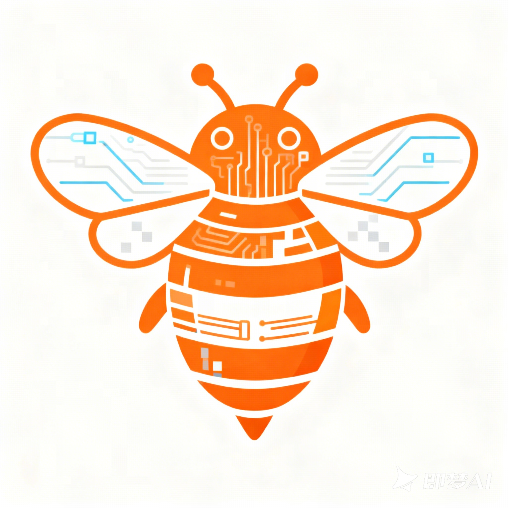

# CodeStyle（码蜂）

<div align="center">



**让历史代码活起来，让 AI 写的更对味！**

[](https://opensource.org/licenses/Apache-2.0)
[](https://openjdk.org/)
[](https://spring.io/projects/spring-boot)
[](https://vuejs.org/)

[官网](https://codestyle.top) · [文档](./project_documentation.md) · [快速开始](#快速开始) · [问题反馈](https://github.com/xxx/issues)

</div>

---

## 📖 项目简介

CodeStyle（码蜂）是一款**企业级代码知识库工具**，通过"官网在线制模 + 轻量化 MCP 插件检索"的创新架构，让 AI 精准理解并复用团队的代码基因。

### 🎯 解决三大核心痛点

| 痛点 | 问题描述 | CodeStyle 方案 |
|-----|---------|---------------|
| 😤 **AI 生成"对而不适"** | AI 写的代码语法没错，但不符合团队风格，每次都要大改 | 模板预置规范，AI 生成即符合团队风格 |
| 😓 **历史代码"躺平闲置"** | 优质代码找不到，新人重复造轮子 | 智能检索，代码资产一次开发终身复用 |
| 😵 **新人"熬秃头皮"** | 上手周期长，跨团队协作风格冲突 | AI 当风格教练，上手周期从周级压缩到小时级 |

### ✨ 核心特性

- 🚀 **3 分钟接入**：零配置即插即用，不改造现有开发流程
- 🔒 **本地组装安全**：模板与代码在本地组装，企业代码零外泄风险
- 🎨 **可视化制模**：官网在线制作风格模板，支持 CRUD、接口、组件等场景
- 🔌 **多 IDE 支持**：支持 Cursor、Windsurf、Trae、Cline 等主流 AI IDE
- 👥 **多租户架构**：支持团队/企业级多租户隔离

---

## 🏗️ 技术架构

```
┌──────────────────────────────────────────────────────────────┐
│                         用户层                                │
│   AI IDE 插件 (Cursor/Windsurf/Trae)  ←→  官网/管理后台        │
└────────────────────────────┬─────────────────────────────────┘
                             │
┌────────────────────────────▼─────────────────────────────────┐
│                       服务层                                  │
│  ┌─────────────┐  ┌─────────────┐  ┌─────────────────────┐  │
│  │ 用户服务     │  │ 代码资产库   │  │ 搜索服务            │  │
│  │ (权限/认证)  │  │ (模板/片段)  │  │ (ES全文检索)        │  │
│  └─────────────┘  └─────────────┘  └─────────────────────┘  │
└────────────────────────────┬─────────────────────────────────┘
                             │
┌────────────────────────────▼─────────────────────────────────┐
│                       数据层                                  │
│   MySQL 8.0  │  Redis 7.2  │  Elasticsearch 8.13  │  Kafka   │
└──────────────────────────────────────────────────────────────┘
```

### 技术栈

| 层级 | 技术选型 |
|-----|---------|
| **前端** | Vue 3 + TypeScript + Vite + TailwindCSS |
| **后端** | Spring Boot 3.2 + Spring Cloud + MyBatis-Plus |
| **安全** | Sa-Token（认证授权）|
| **数据库** | MySQL 8.0 + Redis 7.2 |
| **搜索** | Elasticsearch 8.13 + Canal + Kafka |
| **部署** | Docker + Docker Compose + Nginx |

---

## 🚀 快速开始

### 环境要求

- JDK 21+
- Node.js 18+
- Docker & Docker Compose
- MySQL 8.0+
- Redis 7.0+

### 方式一：Docker 一键部署（推荐）

```bash
# 1. 克隆项目
git clone https://github.com/xxx/codestyle.git
cd codestyle

# 2. 进入 Docker 目录
cd codestyle-admin/docker

# 3. 修改配置（可选）
# 编辑 docker-compose.yml 中的数据库密码等配置

# 4. 启动所有服务
docker-compose up -d

# 5. 查看服务状态
docker-compose ps
```

启动成功后：
- 管理后台：http://localhost:80
- API 服务：http://localhost:18000
- 默认账号：admin / admin123

### 方式二：本地开发

**后端启动**

```bash
# 进入后端目录
cd codestyle-admin

# 编译项目
mvn clean package -DskipTests

# 启动服务
java -jar codestyle-server/target/codestyle-server.jar
```

**前端启动**

```bash
# 进入前端目录
cd codestyle-web

# 安装依赖
npm install

# 启动开发服务器
npm run dev
```

---

## 📁 项目结构

```
codestyle-main/
├── codestyle-admin/              # 管理后台服务
│   ├── codestyle-server/         # 启动模块
│   ├── codestyle-system/         # 系统管理模块
│   ├── codestyle-common/         # 公共模块
│   ├── codestyle-plugin/         # 插件模块
│   │   ├── codestyle-plugin-generator/   # 代码生成器
│   │   ├── codestyle-plugin-search/      # 搜索服务
│   │   ├── codestyle-plugin-tenant/      # 多租户
│   │   └── codestyle-plugin-schedule/    # 任务调度
│   └── docker/                   # Docker 部署配置
│
├── codestyle-cloud/              # 云服务模块
│   ├── codestyle-user/           # 用户服务
│   ├── codestyle-file/           # 文件服务
│   ├── codestyle-library/        # 代码资产库
│   ├── codestyle-ai/             # AI 能力服务
│   └── codestyle-model/          # 数据模型
│
├── codestyle-web/                # 官网前端
│   ├── src/
│   │   ├── components/           # Vue 组件
│   │   └── assets/               # 静态资源
│   └── package.json
│
├── codestyle-maker/              # 模板处理服务 (Python)
│
├── project_documentation.md      # 项目技术文档
├── project_info.md               # 项目基本信息
├── user_scenario.md              # 用户场景说明
└── README.md                     # 项目说明文档
```

---

## 🔌 MCP 插件使用

### 支持的 AI IDE

<div align="center">

| IDE | 状态 | 说明 |
|-----|-----|------|
|  Cursor | ✅ 已支持 | 完整功能支持 |
|  Windsurf | ✅ 已支持 | 完整功能支持 |
|  Trae | ✅ 已支持 | 完整功能支持 |
|  Cline | ✅ 已支持 | VSCode 插件 |

</div>

### 插件配置

在 AI IDE 的 MCP 配置中添加：

```json
{
  "mcpServers": {
    "codestyle": {
      "command": "npx",
      "args": ["-y", "@codestyle/mcp-server"],
      "env": {
        "CODESTYLE_API_URL": "https://api.codestyle.top",
        "CODESTYLE_API_KEY": "your-api-key"
      }
    }
  }
}
```

---

## 📊 效果数据

| 指标 | 提升幅度 | 说明 |
|-----|---------|------|
| **AI 风格对齐** | 90%+ | 生成代码贴合度大幅提升 |
| **资产利用率** | 60%+ | 历史代码复用率从 10% 提升 |
| **新人上手** | 80% | 上手周期大幅缩短 |
| **接入耗时** | 3 分钟 | 零成本即插即用 |

---

## 🗺️ 路线图

- [x] 管理后台基础框架
- [x] 多租户架构
- [x] 搜索模块（ES + Canal）
- [x] 官网展示页
- [ ] 可视化模板编辑器
- [ ] MCP 插件市场
- [ ] 代码资产自动分析
- [ ] 团队协作功能增强
- [ ] 更多编程语言支持

---

## 🤝 参与贡献

我们欢迎所有形式的贡献！

1. Fork 本仓库
2. 创建特性分支 (`git checkout -b feature/AmazingFeature`)
3. 提交更改 (`git commit -m 'Add some AmazingFeature'`)
4. 推送到分支 (`git push origin feature/AmazingFeature`)
5. 提交 Pull Request

---

## 📄 开源协议

本项目采用 [Apache 2.0](LICENSE) 开源协议。

---

## 📞 联系我们

- 📧 邮箱：（待补充）
- 💬 微信群：（待补充）
- 🐛 问题反馈：[GitHub Issues](https://github.com/xxx/issues)

---

<div align="center">

**如果这个项目对你有帮助，请给我们一个 ⭐ Star！**

Made with ❤️ by CodeStyle Team

</div>

