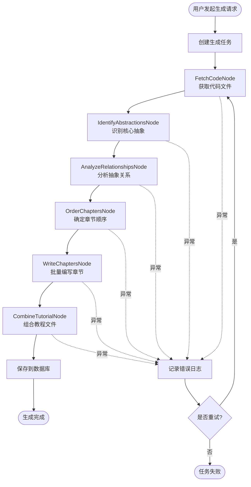

# CodeStyle Wiki 插件迁移规划文档

> 将 PocketFlow-Tutorial-Codebase-Knowledge 迁移到 codestyle-plugin-wiki 模块
> 
> **项目版本**: 4.1.0  
> **文档日期**: 2026-01-29  
> **规划作者**: CodeStyle Team

---

## 📋 目录

1. [项目概述](#1-项目概述)
2. [迁移目标](#2-迁移目标)
3. [架构设计](#3-架构设计)
4. [技术选型](#4-技术选型)
5. [模块结构](#5-模块结构)
6. [核心功能设计](#6-核心功能设计)
7. [数据库设计](#7-数据库设计)
8. [API 设计](#8-api-设计)
9. [前端设计](#9-前端设计)
10. [实施计划](#10-实施计划)
11. [风险评估](#11-风险评估)
12. [附录](#12-附录)

---

## 1. 项目概述

### 1.1 背景

**PocketFlow-Tutorial-Codebase-Knowledge** 是一个基于 AI 的代码库知识构建工具，能够：
- 自动分析 GitHub 仓库或本地代码目录
- 识别核心抽象概念和它们之间的关系
- 生成适合初学者的教程文档
- 支持多语言教程生成

### 1.2 迁移原因

将该功能集成到 CodeStyle 项目中，作为 **codestyle-plugin-wiki** 插件模块，可以：

✅ **统一技术栈**：与现有 Spring Boot + Vue 3 架构保持一致  
✅ **企业级增强**：添加权限控制、多租户、审计日志等企业特性  
✅ **数据持久化**：将生成的教程存储到数据库，支持版本管理  
✅ **用户体验优化**：提供 Web UI 界面，支持在线编辑和预览  
✅ **集成现有功能**：与代码生成器、搜索模块等功能联动

### 1.3 核心价值

- **知识沉淀**：将项目代码库转化为可持久化的知识文档
- **团队协作**：支持多人协作编辑和审核教程
- **快速上手**：新成员通过 AI 生成的教程快速理解项目架构
- **持续更新**：代码变更时可重新生成或增量更新教程

---

## 2. 迁移目标

### 2.1 功能目标

#### 核心功能（P0 - 必须实现）

- [x] **代码库分析**：支持 GitHub 仓库和本地目录分析
- [x] **抽象识别**：使用 LLM 识别核心抽象概念
- [x] **关系分析**：分析抽象之间的交互关系
- [x] **教程生成**：自动生成 Markdown 格式教程
- [x] **多语言支持**：支持中文、英文等多语言教程

#### 企业级增强（P1 - 重要功能）

- [ ] **权限控制**：基于 Sa-Token 的权限管理
- [ ] **多租户支持**：租户级别的数据隔离
- [ ] **版本管理**：教程的版本控制和历史记录
- [ ] **在线编辑**：Web 界面编辑和预览教程
- [ ] **审核流程**：教程发布前的审核机制

#### 扩展功能（P2 - 可选功能）

- [ ] **增量更新**：代码变更时增量更新教程
- [ ] **协作编辑**：多人实时协作编辑
- [ ] **导出功能**：导出为 PDF、HTML 等格式
- [ ] **搜索集成**：与 codestyle-plugin-search 集成

### 2.2 技术目标

- ✅ **遵循 CodeStyle 最佳实践**：代码风格、架构设计、命名规范
- ✅ **模块化设计**：插件化架构，可独立部署
- ✅ **高性能**：异步处理、批量操作、缓存优化
- ✅ **可扩展**：支持自定义 LLM 提供商、自定义模板
- ✅ **可测试**：单元测试覆盖率 > 70%

### 2.3 非功能目标

- **性能**：单个代码库分析时间 < 5 分钟（中等规模项目）
- **可用性**：系统可用性 > 99.9%
- **安全性**：敏感数据加密存储，API 访问控制
- **可维护性**：代码注释覆盖率 > 60%，文档完善

---

## 3. 架构设计

### 3.1 整体架构

```
┌─────────────────────────────────────────────────────────────┐
│                     CodeStyle Admin                          │
├─────────────────────────────────────────────────────────────┤
│                                                               │
│  ┌──────────────┐  ┌──────────────┐  ┌──────────────┐      │
│  │ codestyle-   │  │ codestyle-   │  │ codestyle-   │      │
│  │ plugin-      │  │ plugin-      │  │ plugin-      │      │
│  │ generator    │  │ search       │  │ wiki         │ ◄─── │
│  └──────────────┘  └──────────────┘  └──────────────┘      │
│                                            │                  │
│  ┌──────────────────────────────────────┐ │                  │
│  │      codestyle-system                │ │                  │
│  │  (用户、角色、权限、租户等)           │ │                  │
│  └──────────────────────────────────────┘ │                  │
│                                            │                  │
│  ┌──────────────────────────────────────┐ │                  │
│  │      codestyle-common                │ │                  │
│  │  (工具类、配置、异常处理等)           │ │                  │
│  └──────────────────────────────────────┘ │                  │
│                                            │                  │
└────────────────────────────────────────────┼──────────────────┘
                                             │
                                             ▼
                              ┌──────────────────────────┐
                              │   外部服务集成            │
                              ├──────────────────────────┤
                              │ • LLM API (Gemini/GPT)  │
                              │ • GitHub API            │
                              │ • Git 仓库              │
                              │ • 文件存储服务          │
                              └──────────────────────────┘
```

### 3.2 模块分层架构

```
codestyle-plugin-wiki/
│
├── Controller 层 (REST API)
│   ├── WikiProjectController      # 项目管理
│   ├── WikiTutorialController     # 教程管理
│   ├── WikiChapterController      # 章节管理
│   └── WikiGenerateController     # 生成任务管理
│
├── Service 层 (业务逻辑)
│   ├── WikiProjectService         # 项目服务
│   ├── WikiTutorialService        # 教程服务
│   ├── WikiChapterService         # 章节服务
│   ├── WikiGenerateService        # 生成服务
│   └── WikiAnalysisService        # 分析服务
│
├── Provider 层 (SPI 实现)
│   ├── LlmProvider               # LLM 提供者接口
│   │   ├── GeminiLlmProvider     # Gemini 实现
│   │   ├── OpenAiLlmProvider     # OpenAI 实现
│   │   └── OllamaLlmProvider     # Ollama 实现
│   │
│   └── CodeSourceProvider        # 代码源提供者接口
│       ├── GitHubSourceProvider  # GitHub 实现
│       └── LocalSourceProvider   # 本地目录实现
│
├── Workflow 层 (工作流引擎)
│   ├── WikiGenerateWorkflow      # 教程生成工作流
│   ├── nodes/                    # 工作流节点
│   │   ├── FetchCodeNode         # 获取代码节点
│   │   ├── IdentifyAbstractionsNode  # 识别抽象节点
│   │   ├── AnalyzeRelationshipsNode  # 分析关系节点
│   │   ├── OrderChaptersNode     # 排序章节节点
│   │   ├── WriteChaptersNode     # 编写章节节点
│   │   └── CombineTutorialNode   # 组合教程节点
│   │
│   └── executor/                 # 执行器
│       ├── WorkflowExecutor      # 工作流执行器
│       └── AsyncTaskExecutor     # 异步任务执行器
│
├── Mapper 层 (数据访问)
│   ├── WikiProjectMapper
│   ├── WikiTutorialMapper
│   ├── WikiChapterMapper
│   └── WikiGenerateTaskMapper
│
└── Model 层 (数据模型)
    ├── entity/                   # 实体类
    ├── query/                    # 查询对象
    ├── request/                  # 请求对象
    └── response/                 # 响应对象
```

### 3.3 工作流设计



---

## 4. 技术选型

### 4.1 后端技术栈

| 技术 | 版本 | 用途 | 说明 |
|------|------|------|------|
| Spring Boot | 3.2.x | 应用框架 | 与现有项目保持一致 |
| MyBatis-Plus | 3.5.x | ORM 框架 | 数据库操作 |
| Sa-Token | 1.37.x | 认证授权 | 权限控制 |
| Hutool | 5.8.x | 工具库 | 常用工具类 |
| OkHttp | 4.x | HTTP 客户端 | 调用 LLM API |
| Jackson | 2.15.x | JSON 处理 | 序列化/反序列化 |
| Redisson | 3.x | 分布式锁 | 任务并发控制 |
| Spring Async | - | 异步处理 | 异步任务执行 |

### 4.2 LLM 集成

| LLM 提供商 | 优先级 | 说明 |
|-----------|--------|------|
| Google Gemini | P0 | 默认提供商，性价比高 |
| OpenAI GPT | P1 | 备选方案，质量高 |
| Ollama | P1 | 本地部署，数据安全 |
| 通义千问 | P2 | 国内备选 |
| 文心一言 | P2 | 国内备选 |

### 4.3 前端技术栈

| 技术 | 版本 | 用途 |
|------|------|------|
| Vue 3 | 3.x | 前端框架 |
| TypeScript | 5.x | 类型系统 |
| Arco Design | 2.x | UI 组件库 |
| Pinia | 2.x | 状态管理 |
| Vite | 5.x | 构建工具 |
| Monaco Editor | - | 代码编辑器 |
| Markdown-it | - | Markdown 渲染 |
| Mermaid | - | 图表渲染 |

### 4.4 存储方案

| 类型 | 技术 | 用途 |
|------|------|------|
| 关系数据库 | MySQL 8.0 | 结构化数据存储 |
| 缓存 | Redis | LLM 响应缓存、分布式锁 |
| 文件存储 | 本地/OSS | 代码文件、生成的文档 |

---

## 5. 模块结构

### 5.1 目录结构

```
codestyle-plugin-wiki/
├── src/
│   ├── main/
│   │   ├── java/top/codestyle/admin/wiki/
│   │   │   ├── config/                    # 配置类
│   │   │   │   ├── WikiProperties.java    # 模块配置
│   │   │   │   ├── LlmConfig.java         # LLM 配置
│   │   │   │   ├── AsyncConfig.java       # 异步配置
│   │   │   │   └── RedisConfig.java       # Redis 配置
│   │   │   │
│   │   │   ├── controller/                # 控制器
│   │   │   │   ├── WikiProjectController.java
│   │   │   │   ├── WikiTutorialController.java
│   │   │   │   ├── WikiChapterController.java
│   │   │   │   └── WikiGenerateController.java
│   │   │   │
│   │   │   ├── service/                   # 服务接口
│   │   │   │   ├── WikiProjectService.java
│   │   │   │   ├── WikiTutorialService.java
│   │   │   │   ├── WikiChapterService.java
│   │   │   │   ├── WikiGenerateService.java
│   │   │   │   └── WikiAnalysisService.java
│   │   │   │
│   │   │   ├── service/impl/              # 服务实现
│   │   │   │   ├── WikiProjectServiceImpl.java
│   │   │   │   ├── WikiTutorialServiceImpl.java
│   │   │   │   ├── WikiChapterServiceImpl.java
│   │   │   │   ├── WikiGenerateServiceImpl.java
│   │   │   │   └── WikiAnalysisServiceImpl.java
│   │   │   │
│   │   │   ├── provider/                  # SPI 提供者
│   │   │   │   ├── spi/                   # SPI 接口
│   │   │   │   │   ├── LlmProvider.java
│   │   │   │   │   └── CodeSourceProvider.java
│   │   │   │   │
│   │   │   │   ├── llm/                   # LLM 实现
│   │   │   │   │   ├── GeminiLlmProvider.java
│   │   │   │   │   ├── OpenAiLlmProvider.java
│   │   │   │   │   └── OllamaLlmProvider.java
│   │   │   │   │
│   │   │   │   └── source/                # 代码源实现
│   │   │   │       ├── GitHubSourceProvider.java
│   │   │   │       └── LocalSourceProvider.java
│   │   │   │
│   │   │   ├── workflow/                  # 工作流
│   │   │   │   ├── WikiGenerateWorkflow.java
│   │   │   │   ├── nodes/                 # 工作流节点
│   │   │   │   │   ├── BaseNode.java
│   │   │   │   │   ├── FetchCodeNode.java
│   │   │   │   │   ├── IdentifyAbstractionsNode.java
│   │   │   │   │   ├── AnalyzeRelationshipsNode.java
│   │   │   │   │   ├── OrderChaptersNode.java
│   │   │   │   │   ├── WriteChaptersNode.java
│   │   │   │   │   └── CombineTutorialNode.java
│   │   │   │   │
│   │   │   │   └── executor/              # 执行器
│   │   │   │       ├── WorkflowExecutor.java
│   │   │   │       └── AsyncTaskExecutor.java
│   │   │   │
│   │   │   ├── mapper/                    # 数据访问
│   │   │   │   ├── WikiProjectMapper.java
│   │   │   │   ├── WikiTutorialMapper.java
│   │   │   │   ├── WikiChapterMapper.java
│   │   │   │   └── WikiGenerateTaskMapper.java
│   │   │   │
│   │   │   ├── model/                     # 数据模型
│   │   │   │   ├── entity/                # 实体类
│   │   │   │   │   ├── WikiProjectDO.java
│   │   │   │   │   ├── WikiTutorialDO.java
│   │   │   │   │   ├── WikiChapterDO.java
│   │   │   │   │   ├── WikiAbstractionDO.java
│   │   │   │   │   ├── WikiRelationshipDO.java
│   │   │   │   │   └── WikiGenerateTaskDO.java
│   │   │   │   │
│   │   │   │   ├── query/                 # 查询对象
│   │   │   │   │   ├── WikiProjectQuery.java
│   │   │   │   │   ├── WikiTutorialQuery.java
│   │   │   │   │   └── WikiChapterQuery.java
│   │   │   │   │
│   │   │   │   ├── request/               # 请求对象
│   │   │   │   │   ├── WikiProjectReq.java
│   │   │   │   │   ├── WikiTutorialReq.java
│   │   │   │   │   ├── WikiChapterReq.java
│   │   │   │   │   └── WikiGenerateReq.java
│   │   │   │   │
│   │   │   │   └── response/              # 响应对象
│   │   │   │       ├── WikiProjectResp.java
│   │   │   │       ├── WikiTutorialResp.java
│   │   │   │       ├── WikiChapterResp.java
│   │   │   │       └── WikiGenerateTaskResp.java
│   │   │   │
│   │   │   ├── enums/                     # 枚举类
│   │   │   │   ├── LlmProviderType.java
│   │   │   │   ├── CodeSourceType.java
│   │   │   │   ├── GenerateStatus.java
│   │   │   │   └── TutorialLanguage.java
│   │   │   │
│   │   │   ├── util/                      # 工具类
│   │   │   │   ├── LlmUtils.java
│   │   │   │   ├── GitUtils.java
│   │   │   │   ├── MarkdownUtils.java
│   │   │   │   └── MermaidUtils.java
│   │   │   │
│   │   │   └── constant/                  # 常量类
│   │   │       ├── WikiConstants.java
│   │   │       └── PromptConstants.java
│   │   │
│   │   └── resources/
│   │       ├── mapper/                    # MyBatis XML
│   │       │   ├── WikiProjectMapper.xml
│   │       │   ├── WikiTutorialMapper.xml
│   │       │   ├── WikiChapterMapper.xml
│   │       │   └── WikiGenerateTaskMapper.xml
│   │       │
│   │       ├── prompts/                   # LLM 提示词模板
│   │       │   ├── identify_abstractions.txt
│   │       │   ├── analyze_relationships.txt
│   │       │   ├── order_chapters.txt
│   │       │   └── write_chapter.txt
│   │       │
│   │       └── application-wiki.yml       # 模块配置
│   │
│   └── test/                              # 测试代码
│       └── java/top/codestyle/admin/wiki/
│           ├── service/
│           ├── workflow/
│           └── provider/
│
├── pom.xml                                # Maven 配置
├── README.md                              # 模块说明
├── DESIGN.md                              # 设计文档
└── MIGRATION_GUIDE.md                     # 迁移指南
```

### 5.2 Maven 依赖配置

```xml
<?xml version="1.0" encoding="UTF-8"?>
<project xmlns="http://maven.apache.org/POM/4.0.0"
         xmlns:xsi="http://www.w3.org/2001/XMLSchema-instance"
         xsi:schemaLocation="http://maven.apache.org/POM/4.0.0 
         http://maven.apache.org/xsd/maven-4.0.0.xsd">
    <modelVersion>4.0.0</modelVersion>
    
    <parent>
        <groupId>top.codestyle</groupId>
        <artifactId>codestyle-plugin</artifactId>
        <version>4.1.0</version>
    </parent>
    
    <artifactId>codestyle-plugin-wiki</artifactId>
    <name>${project.artifactId}</name>
    <description>Wiki 教程生成插件</description>
    
    <dependencies>
        <!-- CodeStyle 依赖 -->
        <dependency>
            <groupId>top.codestyle</groupId>
            <artifactId>codestyle-common</artifactId>
        </dependency>
        
        <!-- Spring Boot -->
        <dependency>
            <groupId>org.springframework.boot</groupId>
            <artifactId>spring-boot-starter-web</artifactId>
        </dependency>
        
        <!-- MyBatis-Plus -->
        <dependency>
            <groupId>com.baomidou</groupId>
            <artifactId>mybatis-plus-spring-boot3-starter</artifactId>
        </dependency>
        
        <!-- Redis -->
        <dependency>
            <groupId>org.springframework.boot</groupId>
            <artifactId>spring-boot-starter-data-redis</artifactId>
        </dependency>
        <dependency>
            <groupId>org.redisson</groupId>
            <artifactId>redisson-spring-boot-starter</artifactId>
        </dependency>
        
        <!-- HTTP 客户端 -->
        <dependency>
            <groupId>com.squareup.okhttp3</groupId>
            <artifactId>okhttp</artifactId>
        </dependency>
        
        <!-- Git 操作 -->
        <dependency>
            <groupId>org.eclipse.jgit</groupId>
            <artifactId>org.eclipse.jgit</artifactId>
            <version>6.8.0.202311291450-r</version>
        </dependency>
        
        <!-- YAML 解析 -->
        <dependency>
            <groupId>org.yaml</groupId>
            <artifactId>snakeyaml</artifactId>
        </dependency>
        
        <!-- Markdown 处理 -->
        <dependency>
            <groupId>com.vladsch.flexmark</groupId>
            <artifactId>flexmark-all</artifactId>
            <version>0.64.8</version>
        </dependency>
        
        <!-- 测试依赖 -->
        <dependency>
            <groupId>org.springframework.boot</groupId>
            <artifactId>spring-boot-starter-test</artifactId>
            <scope>test</scope>
        </dependency>
    </dependencies>
</project>
```

---

## 6. 核心功能设计

详见 [WIKI_MIGRATION_PLAN_PART2.md](./WIKI_MIGRATION_PLAN_PART2.md)

---

## 7. 数据库设计

详见 [WIKI_MIGRATION_PLAN_PART2.md](./WIKI_MIGRATION_PLAN_PART2.md)

---

## 8. API 设计

详见 [WIKI_MIGRATION_PLAN_PART3.md](./WIKI_MIGRATION_PLAN_PART3.md)

---

## 9. 前端设计

详见 [WIKI_MIGRATION_PLAN_PART3.md](./WIKI_MIGRATION_PLAN_PART3.md)

---

## 10. 实施计划

详见 [WIKI_MIGRATION_PLAN_PART4.md](./WIKI_MIGRATION_PLAN_PART4.md)

---

## 11. 风险评估

详见 [WIKI_MIGRATION_PLAN_PART4.md](./WIKI_MIGRATION_PLAN_PART4.md)

---

## 12. 附录

详见 [WIKI_MIGRATION_PLAN_PART4.md](./WIKI_MIGRATION_PLAN_PART4.md)

---

**文档维护**: CodeStyle Team  
**最后更新**: 2026-01-29

