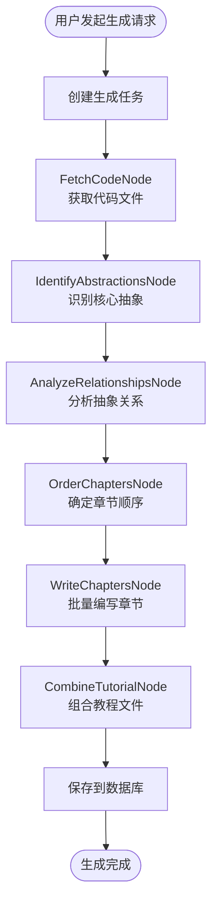

# CodeStyle Wiki 插件迁移规划文档

> 将 PocketFlow-Tutorial-Codebase-Knowledge 迁移到 codestyle-plugin-wiki 模块
> 
> **项目版本**: 4.1.0  
> **文档日期**: 2026-01-29

---

## 📋 目录

1. [项目概述](#1-项目概述)
2. [迁移目标](#2-迁移目标)
3. [架构设计](#3-架构设计)
4. [核心功能设计](#4-核心功能设计)
5. [数据库设计](#5-数据库设计)
6. [API 设计](#6-api-设计)
7. [实施计划](#7-实施计划)

---

## 1. 项目概述

### 1.1 背景

**PocketFlow-Tutorial-Codebase-Knowledge** 是一个基于 AI 的代码库知识构建工具，能够：
- 自动分析 GitHub 仓库或本地代码目录
- 识别核心抽象概念和它们之间的关系
- 生成适合初学者的教程文档
- 支持多语言教程生成

### 1.2 迁移价值

✅ **统一技术栈**：与现有 Spring Boot + Vue 3 架构保持一致  
✅ **企业级增强**：添加权限控制、多租户、审计日志等企业特性  
✅ **数据持久化**：将生成的教程存储到数据库，支持版本管理  
✅ **用户体验优化**：提供 Web UI 界面，支持在线编辑和预览  
✅ **集成现有功能**：与代码生成器、搜索模块等功能联动

---

## 2. 迁移目标

### 2.1 核心功能（P0）

- [x] 代码库分析（GitHub 仓库和本地目录）
- [x] 抽象识别（使用 LLM 识别核心概念）
- [x] 关系分析（分析抽象之间的交互）
- [x] 教程生成（自动生成 Markdown 教程）
- [x] 多语言支持（中文、英文等）

### 2.2 企业级增强（P1）

- [ ] 权限控制（基于 Sa-Token）
- [ ] 多租户支持（租户级别数据隔离）
- [ ] 版本管理（教程版本控制）
- [ ] 在线编辑（Web 界面编辑预览）
- [ ] 审核流程（发布前审核）

### 2.3 扩展功能（P2）

- [ ] 增量更新（代码变更时增量更新）
- [ ] 协作编辑（多人实时协作）
- [ ] 导出功能（PDF、HTML 等格式）
- [ ] 搜索集成（与 search 模块集成）

---

## 3. 架构设计

### 3.1 整体架构

```
codestyle-plugin-wiki/
├── Controller 层 (REST API)
│   ├── WikiProjectController      # 项目管理
│   ├── WikiTutorialController     # 教程管理
│   ├── WikiChapterController      # 章节管理
│   └── WikiGenerateController     # 生成任务管理
│
├── Service 层 (业务逻辑)
│   ├── WikiProjectService         # 项目服务
│   ├── WikiTutorialService        # 教程服务
│   ├── WikiGenerateService        # 生成服务
│   └── WikiAnalysisService        # 分析服务
│
├── Provider 层 (SPI 实现)
│   ├── LlmProvider               # LLM 提供者接口
│   │   ├── GeminiLlmProvider     # Gemini 实现
│   │   ├── OpenAiLlmProvider     # OpenAI 实现
│   │   └── OllamaLlmProvider     # Ollama 实现
│   └── CodeSourceProvider        # 代码源提供者接口
│       ├── GitHubSourceProvider  # GitHub 实现
│       └── LocalSourceProvider   # 本地目录实现
│
├── Workflow 层 (工作流引擎)
│   ├── WikiGenerateWorkflow      # 教程生成工作流
│   └── nodes/                    # 工作流节点
│       ├── FetchCodeNode         # 获取代码
│       ├── IdentifyAbstractionsNode  # 识别抽象
│       ├── AnalyzeRelationshipsNode  # 分析关系
│       ├── OrderChaptersNode     # 排序章节
│       ├── WriteChaptersNode     # 编写章节
│       └── CombineTutorialNode   # 组合教程
│
└── Mapper 层 (数据访问)
    ├── WikiProjectMapper
    ├── WikiTutorialMapper
    ├── WikiChapterMapper
    └── WikiGenerateTaskMapper
```

### 3.2 工作流设计



---

## 4. 核心功能设计

### 4.1 LLM Provider 接口

```java
/**
 * LLM 提供者接口
 */
public interface LlmProvider {
    
    /**
     * 调用 LLM
     * @param prompt 提示词
     * @param systemPrompt 系统提示词
     * @param useCache 是否使用缓存
     * @return LLM 响应
     */
    String call(String prompt, String systemPrompt, boolean useCache);
    
    /**
     * 获取提供者类型
     */
    LlmProviderType getType();
    
    /**
     * 是否可用
     */
    boolean isAvailable();
}
```

### 4.2 工作流节点接口

```java
/**
 * 工作流节点基类
 */
public abstract class BaseNode {
    
    /**
     * 执行节点逻辑
     * @param context 工作流上下文
     */
    public abstract void execute(WorkflowContext context);
    
    /**
     * 节点名称
     */
    public abstract String getName();
    
    /**
     * 最大重试次数
     */
    protected int getMaxRetries() {
        return 3;
    }
}
```

### 4.3 核心服务接口

```java
/**
 * Wiki 生成服务
 */
public interface WikiGenerateService {
    
    /**
     * 创建生成任务
     */
    Long createTask(WikiGenerateReq req);
    
    /**
     * 执行生成任务（异步）
     */
    void executeTask(Long taskId);
    
    /**
     * 查询任务状态
     */
    WikiGenerateTaskResp getTaskStatus(Long taskId);
    
    /**
     * 取消任务
     */
    void cancelTask(Long taskId);
}
```

---

## 5. 数据库设计

### 5.1 项目表 (wiki_project)

```sql
CREATE TABLE `wiki_project` (
  `id` bigint NOT NULL COMMENT 'ID',
  `name` varchar(100) NOT NULL COMMENT '项目名称',
  `description` varchar(500) COMMENT '项目描述',
  `source_type` tinyint NOT NULL COMMENT '代码源类型（1:GitHub 2:本地）',
  `source_url` varchar(500) COMMENT '源地址',
  `language` varchar(20) DEFAULT 'zh-CN' COMMENT '教程语言',
  `status` tinyint DEFAULT 1 COMMENT '状态（1:启用 2:禁用）',
  `tenant_id` bigint DEFAULT 0 COMMENT '租户ID',
  `create_user` bigint COMMENT '创建人',
  `create_time` datetime DEFAULT CURRENT_TIMESTAMP COMMENT '创建时间',
  `update_user` bigint COMMENT '修改人',
  `update_time` datetime ON UPDATE CURRENT_TIMESTAMP COMMENT '修改时间',
  `deleted` bigint DEFAULT 0 COMMENT '逻辑删除',
  PRIMARY KEY (`id`),
  KEY `idx_tenant_id` (`tenant_id`),
  KEY `idx_create_time` (`create_time`)
) ENGINE=InnoDB COMMENT='Wiki项目表';
```

### 5.2 教程表 (wiki_tutorial)

```sql
CREATE TABLE `wiki_tutorial` (
  `id` bigint NOT NULL COMMENT 'ID',
  `project_id` bigint NOT NULL COMMENT '项目ID',
  `version` varchar(50) NOT NULL COMMENT '版本号',
  `summary` text COMMENT '项目摘要',
  `mermaid_diagram` text COMMENT 'Mermaid关系图',
  `status` tinyint DEFAULT 1 COMMENT '状态（1:草稿 2:已发布）',
  `publish_time` datetime COMMENT '发布时间',
  `tenant_id` bigint DEFAULT 0 COMMENT '租户ID',
  `create_user` bigint COMMENT '创建人',
  `create_time` datetime DEFAULT CURRENT_TIMESTAMP COMMENT '创建时间',
  `update_user` bigint COMMENT '修改人',
  `update_time` datetime ON UPDATE CURRENT_TIMESTAMP COMMENT '修改时间',
  `deleted` bigint DEFAULT 0 COMMENT '逻辑删除',
  PRIMARY KEY (`id`),
  KEY `idx_project_id` (`project_id`),
  KEY `idx_tenant_id` (`tenant_id`)
) ENGINE=InnoDB COMMENT='Wiki教程表';
```

### 5.3 章节表 (wiki_chapter)

```sql
CREATE TABLE `wiki_chapter` (
  `id` bigint NOT NULL COMMENT 'ID',
  `tutorial_id` bigint NOT NULL COMMENT '教程ID',
  `abstraction_id` bigint NOT NULL COMMENT '抽象ID',
  `chapter_order` int NOT NULL COMMENT '章节顺序',
  `title` varchar(200) NOT NULL COMMENT '章节标题',
  `content` longtext NOT NULL COMMENT '章节内容（Markdown）',
  `tenant_id` bigint DEFAULT 0 COMMENT '租户ID',
  `create_user` bigint COMMENT '创建人',
  `create_time` datetime DEFAULT CURRENT_TIMESTAMP COMMENT '创建时间',
  `update_user` bigint COMMENT '修改人',
  `update_time` datetime ON UPDATE CURRENT_TIMESTAMP COMMENT '修改时间',
  `deleted` bigint DEFAULT 0 COMMENT '逻辑删除',
  PRIMARY KEY (`id`),
  KEY `idx_tutorial_id` (`tutorial_id`),
  KEY `idx_chapter_order` (`chapter_order`)
) ENGINE=InnoDB COMMENT='Wiki章节表';
```

### 5.4 抽象表 (wiki_abstraction)

```sql
CREATE TABLE `wiki_abstraction` (
  `id` bigint NOT NULL COMMENT 'ID',
  `tutorial_id` bigint NOT NULL COMMENT '教程ID',
  `name` varchar(100) NOT NULL COMMENT '抽象名称',
  `description` varchar(500) COMMENT '抽象描述',
  `related_files` json COMMENT '相关文件列表',
  `tenant_id` bigint DEFAULT 0 COMMENT '租户ID',
  `create_time` datetime DEFAULT CURRENT_TIMESTAMP COMMENT '创建时间',
  `deleted` bigint DEFAULT 0 COMMENT '逻辑删除',
  PRIMARY KEY (`id`),
  KEY `idx_tutorial_id` (`tutorial_id`)
) ENGINE=InnoDB COMMENT='Wiki抽象表';
```

### 5.5 关系表 (wiki_relationship)

```sql
CREATE TABLE `wiki_relationship` (
  `id` bigint NOT NULL COMMENT 'ID',
  `tutorial_id` bigint NOT NULL COMMENT '教程ID',
  `from_abstraction_id` bigint NOT NULL COMMENT '源抽象ID',
  `to_abstraction_id` bigint NOT NULL COMMENT '目标抽象ID',
  `label` varchar(100) COMMENT '关系标签',
  `tenant_id` bigint DEFAULT 0 COMMENT '租户ID',
  `create_time` datetime DEFAULT CURRENT_TIMESTAMP COMMENT '创建时间',
  `deleted` bigint DEFAULT 0 COMMENT '逻辑删除',
  PRIMARY KEY (`id`),
  KEY `idx_tutorial_id` (`tutorial_id`)
) ENGINE=InnoDB COMMENT='Wiki关系表';
```

### 5.6 生成任务表 (wiki_generate_task)

```sql
CREATE TABLE `wiki_generate_task` (
  `id` bigint NOT NULL COMMENT 'ID',
  `project_id` bigint NOT NULL COMMENT '项目ID',
  `status` tinyint DEFAULT 1 COMMENT '状态（1:待执行 2:执行中 3:成功 4:失败）',
  `progress` int DEFAULT 0 COMMENT '进度（0-100）',
  `current_node` varchar(50) COMMENT '当前节点',
  `error_message` text COMMENT '错误信息',
  `config` json COMMENT '生成配置',
  `result` json COMMENT '生成结果',
  `tenant_id` bigint DEFAULT 0 COMMENT '租户ID',
  `create_user` bigint COMMENT '创建人',
  `create_time` datetime DEFAULT CURRENT_TIMESTAMP COMMENT '创建时间',
  `update_time` datetime ON UPDATE CURRENT_TIMESTAMP COMMENT '修改时间',
  `deleted` bigint DEFAULT 0 COMMENT '逻辑删除',
  PRIMARY KEY (`id`),
  KEY `idx_project_id` (`project_id`),
  KEY `idx_status` (`status`)
) ENGINE=InnoDB COMMENT='Wiki生成任务表';
```

---

## 6. API 设计

### 6.1 项目管理 API

```java
@Tag(name = "Wiki 项目管理 API")
@RestController
@RequestMapping("/wiki/project")
public class WikiProjectController {

    @Operation(summary = "查询项目列表")
    @SaCheckPermission("wiki:project:list")
    @GetMapping
    public PageResp<WikiProjectResp> page(WikiProjectQuery query, PageQuery pageQuery) {
        return wikiProjectService.page(query, pageQuery);
    }

    @Operation(summary = "新增项目")
    @SaCheckPermission("wiki:project:create")
    @PostMapping
    public Long add(@Valid @RequestBody WikiProjectReq req) {
        return wikiProjectService.add(req);
    }

    @Operation(summary = "修改项目")
    @SaCheckPermission("wiki:project:update")
    @PutMapping("/{id}")
    public void update(@Valid @RequestBody WikiProjectReq req, @PathVariable Long id) {
        wikiProjectService.update(req, id);
    }

    @Operation(summary = "删除项目")
    @SaCheckPermission("wiki:project:delete")
    @DeleteMapping
    public void delete(@RequestBody List<Long> ids) {
        wikiProjectService.delete(ids);
    }
}
```

### 6.2 生成任务 API

```java
@Tag(name = "Wiki 生成任务 API")
@RestController
@RequestMapping("/wiki/generate")
public class WikiGenerateController {

    @Operation(summary = "创建生成任务")
    @SaCheckPermission("wiki:generate:create")
    @PostMapping
    public Long createTask(@Valid @RequestBody WikiGenerateReq req) {
        return wikiGenerateService.createTask(req);
    }

    @Operation(summary = "查询任务状态")
    @SaCheckPermission("wiki:generate:query")
    @GetMapping("/{taskId}")
    public WikiGenerateTaskResp getTaskStatus(@PathVariable Long taskId) {
        return wikiGenerateService.getTaskStatus(taskId);
    }

    @Operation(summary = "取消任务")
    @SaCheckPermission("wiki:generate:cancel")
    @PostMapping("/{taskId}/cancel")
    public void cancelTask(@PathVariable Long taskId) {
        wikiGenerateService.cancelTask(taskId);
    }
}
```

### 6.3 教程管理 API

```java
@Tag(name = "Wiki 教程管理 API")
@RestController
@RequestMapping("/wiki/tutorial")
public class WikiTutorialController {

    @Operation(summary = "查询教程列表")
    @SaCheckPermission("wiki:tutorial:list")
    @GetMapping
    public PageResp<WikiTutorialResp> page(WikiTutorialQuery query, PageQuery pageQuery) {
        return wikiTutorialService.page(query, pageQuery);
    }

    @Operation(summary = "查询教程详情")
    @SaCheckPermission("wiki:tutorial:query")
    @GetMapping("/{id}")
    public WikiTutorialDetailResp getDetail(@PathVariable Long id) {
        return wikiTutorialService.getDetail(id);
    }

    @Operation(summary = "发布教程")
    @SaCheckPermission("wiki:tutorial:publish")
    @PostMapping("/{id}/publish")
    public void publish(@PathVariable Long id) {
        wikiTutorialService.publish(id);
    }

    @Operation(summary = "导出教程")
    @SaCheckPermission("wiki:tutorial:export")
    @GetMapping("/{id}/export")
    public void export(@PathVariable Long id, HttpServletResponse response) {
        wikiTutorialService.export(id, response);
    }
}
```

---

## 7. 实施计划

### 7.1 阶段一：基础架构搭建（1-2周）

**目标**：完成模块基础架构和核心接口定义

- [ ] 创建 codestyle-plugin-wiki 模块
- [ ] 配置 Maven 依赖
- [ ] 定义数据库表结构
- [ ] 创建实体类和 Mapper
- [ ] 定义 SPI 接口（LlmProvider、CodeSourceProvider）
- [ ] 实现配置类（WikiProperties、LlmConfig）

**交付物**：
- 模块目录结构
- 数据库建表脚本
- 核心接口定义

### 7.2 阶段二：LLM 集成（1-2周）

**目标**：实现 LLM 提供者和缓存机制

- [ ] 实现 GeminiLlmProvider
- [ ] 实现 OpenAiLlmProvider
- [ ] 实现 OllamaLlmProvider
- [ ] 实现 Redis 缓存机制
- [ ] 实现提示词模板管理
- [ ] 编写单元测试

**交付物**：
- LLM 提供者实现
- 缓存机制
- 单元测试

### 7.3 阶段三：工作流引擎（2-3周）

**目标**：实现教程生成工作流

- [ ] 实现 FetchCodeNode（获取代码）
- [ ] 实现 IdentifyAbstractionsNode（识别抽象）
- [ ] 实现 AnalyzeRelationshipsNode（分析关系）
- [ ] 实现 OrderChaptersNode（排序章节）
- [ ] 实现 WriteChaptersNode（编写章节）
- [ ] 实现 CombineTutorialNode（组合教程）
- [ ] 实现 WorkflowExecutor（工作流执行器）
- [ ] 实现异步任务执行

**交付物**：
- 工作流节点实现
- 工作流执行器
- 异步任务机制

### 7.4 阶段四：业务服务层（1-2周）

**目标**：实现业务逻辑和 API 接口

- [ ] 实现 WikiProjectService
- [ ] 实现 WikiTutorialService
- [ ] 实现 WikiGenerateService
- [ ] 实现 Controller 层
- [ ] 添加权限控制
- [ ] 添加多租户支持

**交付物**：
- Service 层实现
- Controller 层实现
- API 文档

### 7.5 阶段五：前端开发（2-3周）

**目标**：实现 Web UI 界面

- [ ] 项目管理页面
- [ ] 教程列表页面
- [ ] 教程详情页面
- [ ] 生成任务页面
- [ ] Markdown 编辑器集成
- [ ] Mermaid 图表渲染

**交付物**：
- 前端页面
- 组件库
- 用户手册

### 7.6 阶段六：测试与优化（1-2周）

**目标**：测试和性能优化

- [ ] 单元测试（覆盖率 > 70%）
- [ ] 集成测试
- [ ] 性能测试
- [ ] 安全测试
- [ ] 代码审查
- [ ] 文档完善

**交付物**：
- 测试报告
- 性能优化报告
- 完整文档

### 7.7 总体时间线

```
Week 1-2:  阶段一 - 基础架构搭建
Week 3-4:  阶段二 - LLM 集成
Week 5-7:  阶段三 - 工作流引擎
Week 8-9:  阶段四 - 业务服务层
Week 10-12: 阶段五 - 前端开发
Week 13-14: 阶段六 - 测试与优化

总计：约 3-4 个月
```

---

## 8. 配置示例

### 8.1 application-wiki.yml

```yaml
# Wiki 模块配置
wiki:
  enabled: true
  
  # LLM 配置
  llm:
    # 默认提供商（GEMINI, OPENAI, OLLAMA）
    default-provider: GEMINI
    
    # Gemini 配置
    gemini:
      enabled: true
      api-key: ${GEMINI_API_KEY}
      model: gemini-2.0-flash-exp
      base-url: https://generativelanguage.googleapis.com
    
    # OpenAI 配置
    openai:
      enabled: false
      api-key: ${OPENAI_API_KEY}
      model: gpt-4
      base-url: https://api.openai.com
    
    # Ollama 配置
    ollama:
      enabled: false
      base-url: http://localhost:11434
      model: llama2
    
    # 缓存配置
    cache:
      enabled: true
      ttl: 86400  # 24小时
  
  # 代码源配置
  source:
    # GitHub 配置
    github:
      token: ${GITHUB_TOKEN}
      timeout: 30000
    
    # 本地目录配置
    local:
      base-path: /data/wiki/repos
  
  # 生成配置
  generate:
    # 最大抽象数量
    max-abstractions: 10
    # 最大文件大小（字节）
    max-file-size: 100000
    # 默认包含模式
    default-include-patterns:
      - "*.java"
      - "*.py"
      - "*.js"
      - "*.ts"
    # 默认排除模式
    default-exclude-patterns:
      - "*/test/*"
      - "*/tests/*"
      - "*/node_modules/*"
      - "*/target/*"
      - "*/build/*"
  
  # 异步任务配置
  async:
    core-pool-size: 5
    max-pool-size: 10
    queue-capacity: 100
```

---

## 9. 关键技术点

### 9.1 遵循 CodeStyle 最佳实践

✅ **代码风格**：使用 P3C 阿里巴巴编码规范  
✅ **分层架构**：Controller → Service → Mapper  
✅ **权限控制**：使用 `@SaCheckPermission` 注解  
✅ **多租户**：使用 `TenantContextHolder`  
✅ **异常处理**：统一异常处理器  
✅ **参数校验**：使用 JSR-303 注解  
✅ **日志记录**：使用 `@Slf4j` 注解  
✅ **事务管理**：使用 `@Transactional` 注解

### 9.2 核心技术难点

**1. LLM 调用稳定性**
- 实现重试机制（最多 5 次）
- 实现超时控制（30 秒）
- 实现响应缓存（Redis）
- 实现降级策略（多个 LLM 提供商）

**2. 工作流可靠性**
- 实现节点状态持久化
- 实现断点续传
- 实现错误恢复
- 实现进度追踪

**3. 大文件处理**
- 实现文件过滤（大小、类型）
- 实现分批处理
- 实现流式读取
- 实现内存优化

**4. 并发控制**
- 使用 Redisson 分布式锁
- 使用线程池管理
- 使用异步任务
- 使用消息队列（可选）

---

## 10. 风险评估

### 10.1 技术风险

| 风险 | 影响 | 概率 | 应对措施 |
|------|------|------|---------|
| LLM API 不稳定 | 高 | 中 | 多提供商支持、重试机制、降级策略 |
| 大代码库处理慢 | 中 | 高 | 文件过滤、分批处理、异步执行 |
| 内存溢出 | 高 | 中 | 流式读取、分批处理、内存监控 |
| 并发冲突 | 中 | 低 | 分布式锁、任务队列 |

### 10.2 业务风险

| 风险 | 影响 | 概率 | 应对措施 |
|------|------|------|---------|
| 生成质量不稳定 | 高 | 中 | 提示词优化、人工审核、版本管理 |
| 成本过高 | 中 | 中 | 缓存机制、本地 LLM、配额控制 |
| 用户体验差 | 中 | 低 | 进度提示、异步处理、结果预览 |

---

## 11. 总结

本迁移规划将 PocketFlow-Tutorial-Codebase-Knowledge 的核心能力集成到 CodeStyle 项目中，形成企业级的 Wiki 教程生成插件。通过遵循 CodeStyle 最佳实践，实现了：

✅ **技术统一**：Spring Boot + Vue 3 技术栈  
✅ **企业增强**：权限、多租户、审计、版本管理  
✅ **用户友好**：Web UI、在线编辑、实时预览  
✅ **高可用**：异步处理、缓存优化、错误恢复  
✅ **可扩展**：SPI 机制、插件化设计

预计开发周期：**3-4 个月**

---

**文档维护**: CodeStyle Team  
**最后更新**: 2026-01-29

