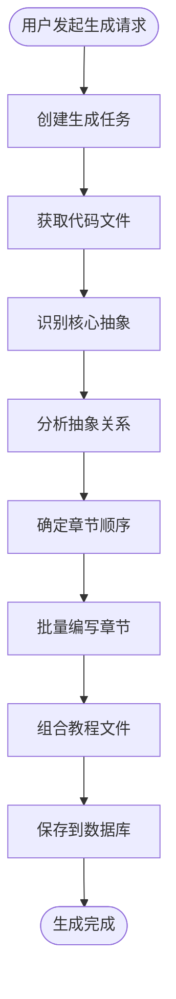

# CodeStyle Wiki 插件文档中心

> 基于 AI 的代码库知识构建与教程生成插件
> 
> **项目版本**: 4.1.0  
> **文档日期**: 2026-01-29

---

## 📚 文档导航

### 🚀 快速开始

如果您是第一次使用，建议从这里开始：

- **[快速开始指南](./WIKI_QUICK_START.md)** - 5分钟快速上手，包含安装、配置和使用示例

### 📋 规划文档

了解项目的整体规划和设计思路：

- **[迁移规划文档](./WIKI_PLUGIN_MIGRATION_PLAN.md)** - 完整的迁移规划，包含架构设计、数据库设计、API 设计等
- **[实现指南](./WIKI_IMPLEMENTATION_GUIDE.md)** - 详细的技术实现细节和代码示例

### 📖 参考文档

深入了解项目的最佳实践：

- **[CodeStyle 最佳实践](../../CODESTYLE_BEST_PRACTICES.md)** - 基础开发规范
- **[CodeStyle 进阶实践](../../CODESTYLE_BEST_PRACTICES_ADVANCED.md)** - 高级架构设计

---

## 🎯 项目概述

### 核心功能

**CodeStyle Wiki 插件**是一个基于 AI 的代码库知识构建工具，能够：

✨ **自动分析代码库**
- 支持 GitHub 仓库和本地目录
- 智能识别核心抽象概念
- 分析抽象之间的关系

✨ **生成教程文档**
- 自动生成 Markdown 格式教程
- 包含 Mermaid 关系图
- 支持多语言（中文、英文等）

✨ **企业级特性**
- 权限控制（基于 Sa-Token）
- 多租户支持
- 版本管理
- 在线编辑

✨ **高性能**
- 异步处理
- Redis 缓存
- 批量操作

### 技术架构

```
┌─────────────────────────────────────────┐
│         CodeStyle Wiki 插件              │
├─────────────────────────────────────────┤
│                                          │
│  Controller 层 (REST API)                │
│  ├─ WikiProjectController                │
│  ├─ WikiTutorialController               │
│  └─ WikiGenerateController               │
│                                          │
│  Service 层 (业务逻辑)                    │
│  ├─ WikiProjectService                   │
│  ├─ WikiTutorialService                  │
│  └─ WikiGenerateService                  │
│                                          │
│  Provider 层 (SPI 实现)                  │
│  ├─ LlmProvider (Gemini/OpenAI/Ollama)  │
│  └─ CodeSourceProvider (GitHub/Local)   │
│                                          │
│  Workflow 层 (工作流引擎)                │
│  ├─ FetchCodeNode                        │
│  ├─ IdentifyAbstractionsNode            │
│  ├─ AnalyzeRelationshipsNode            │
│  ├─ OrderChaptersNode                   │
│  ├─ WriteChaptersNode                   │
│  └─ CombineTutorialNode                 │
│                                          │
└─────────────────────────────────────────┘
```

### 工作流程



---

## 🛠️ 技术栈

### 后端

| 技术 | 版本 | 用途 |
|------|------|------|
| Spring Boot | 3.2.x | 应用框架 |
| MyBatis-Plus | 3.5.x | ORM 框架 |
| Sa-Token | 1.37.x | 认证授权 |
| Redis | 7.x | 缓存 |
| MySQL | 8.0 | 数据库 |
| OkHttp | 4.x | HTTP 客户端 |

### 前端

| 技术 | 版本 | 用途 |
|------|------|------|
| Vue 3 | 3.x | 前端框架 |
| TypeScript | 5.x | 类型系统 |
| Arco Design | 2.x | UI 组件库 |
| Pinia | 2.x | 状态管理 |
| Vite | 5.x | 构建工具 |

### LLM 集成

| 提供商 | 优先级 | 说明 |
|--------|--------|------|
| Google Gemini | P0 | 默认提供商 |
| OpenAI GPT | P1 | 备选方案 |
| Ollama | P1 | 本地部署 |

---

## 📦 快速安装

### 1. 克隆项目

```bash
git clone https://github.com/your-org/codestyle.git
cd codestyle
```

### 2. 配置环境变量

```bash
# 创建 .env 文件
echo "GEMINI_API_KEY=your_api_key_here" > .env
echo "GITHUB_TOKEN=your_token_here" >> .env
```

### 3. 初始化数据库

```bash
mysql -u root -p < codestyle-admin/codestyle-plugin/sql/wiki_tables.sql
```

### 4. 启动服务

```bash
# 后端
cd codestyle-admin
mvn spring-boot:run

# 前端
cd codestyle-admin-web
pnpm install && pnpm dev
```

### 5. 访问应用

- 前端：http://localhost:5173
- 后端：http://localhost:18000
- API 文档：http://localhost:18000/swagger-ui.html

---

## 🎯 使用示例

### 示例 1：分析 GitHub 仓库

```bash
# 1. 创建项目
curl -X POST http://localhost:18000/api/wiki/project \
  -H "Content-Type: application/json" \
  -d '{
    "name": "FastAPI",
    "sourceType": 1,
    "sourceUrl": "https://github.com/tiangolo/fastapi",
    "language": "zh-CN"
  }'

# 2. 创建生成任务
curl -X POST http://localhost:18000/api/wiki/generate \
  -H "Content-Type: application/json" \
  -d '{
    "projectId": 1,
    "maxAbstractions": 10,
    "includePatterns": ["*.py"],
    "excludePatterns": ["*/tests/*"]
  }'

# 3. 查询任务状态
curl -X GET http://localhost:18000/api/wiki/generate/1
```

### 示例 2：Web UI 操作

1. 访问 http://localhost:5173/wiki/project
2. 点击"新增项目"
3. 填写项目信息
4. 点击"生成教程"
5. 等待生成完成
6. 查看教程详情

---

## 📊 核心特性

### 1. 智能代码分析

- ✅ 自动识别核心抽象概念
- ✅ 分析抽象之间的关系
- ✅ 生成 Mermaid 关系图
- ✅ 支持多种编程语言

### 2. 教程生成

- ✅ 自动生成 Markdown 教程
- ✅ 包含代码示例和解释
- ✅ 使用类比和示例说明
- ✅ 支持多语言生成

### 3. 企业级功能

- ✅ 权限控制（细粒度）
- ✅ 多租户支持（数据隔离）
- ✅ 版本管理（历史记录）
- ✅ 审核流程（发布前审核）

### 4. 用户体验

- ✅ Web UI 界面
- ✅ 在线编辑预览
- ✅ 实时进度显示
- ✅ 导出多种格式

---

## 🔧 配置说明

### 基础配置

```yaml
wiki:
  enabled: true
  llm:
    default-provider: GEMINI
    gemini:
      enabled: true
      api-key: ${GEMINI_API_KEY}
      model: gemini-2.0-flash-exp
```

### 高级配置

```yaml
wiki:
  generate:
    max-abstractions: 10
    max-file-size: 100000
  async:
    core-pool-size: 5
    max-pool-size: 10
  llm:
    cache:
      enabled: true
      ttl: 86400
```

详细配置请参考：[快速开始指南](./WIKI_QUICK_START.md)

---

## 📈 性能指标

| 指标 | 目标值 | 说明 |
|------|--------|------|
| 单个项目分析时间 | < 5 分钟 | 中等规模项目（1000 文件） |
| API 响应时间 | < 200ms | 查询接口 |
| 并发任务数 | 10+ | 同时执行的生成任务 |
| 缓存命中率 | > 80% | LLM 响应缓存 |

---

## 🐛 常见问题

### Q1: LLM API 调用失败？

**解决方案**：
1. 检查 API Key 配置
2. 检查网络连接
3. 查看日志文件

### Q2: 生成任务卡住？

**解决方案**：
1. 增加超时时间
2. 减少文件数量
3. 使用更强大的 LLM

### Q3: 教程质量不高？

**解决方案**：
1. 调整抽象数量
2. 使用更好的 LLM 模型
3. 手动编辑优化

更多问题请参考：[快速开始指南](./WIKI_QUICK_START.md#常见问题)

---

## 🗺️ 开发路线图

### 已完成 ✅

- [x] 基础架构设计
- [x] LLM 集成（Gemini/OpenAI/Ollama）
- [x] 工作流引擎
- [x] 数据库设计
- [x] API 设计

### 进行中 🚧

- [ ] 前端 UI 开发
- [ ] 单元测试
- [ ] 文档完善

### 计划中 📅

- [ ] 增量更新
- [ ] 协作编辑
- [ ] 导出功能（PDF/HTML）
- [ ] 搜索集成

---

## 🤝 贡献指南

欢迎贡献代码、报告问题或提出建议！

### 贡献流程

1. Fork 项目
2. 创建特性分支 (`git checkout -b feature/AmazingFeature`)
3. 提交更改 (`git commit -m 'Add some AmazingFeature'`)
4. 推送到分支 (`git push origin feature/AmazingFeature`)
5. 开启 Pull Request

### 代码规范

请遵循 [CodeStyle 最佳实践](../../CODESTYLE_BEST_PRACTICES.md)

---

## 📄 许可证

Apache License 2.0

---

## 👥 团队

**CodeStyle Team**

- 架构设计：[@architect](https://github.com/architect)
- 后端开发：[@backend-dev](https://github.com/backend-dev)
- 前端开发：[@frontend-dev](https://github.com/frontend-dev)
- 文档维护：[@doc-writer](https://github.com/doc-writer)

---

## 📞 联系我们

- 📧 Email: team@codestyle.top
- 💬 Discord: [加入我们](https://discord.gg/codestyle)
- 🐛 Issues: [GitHub Issues](https://github.com/your-org/codestyle/issues)

---

## 🙏 致谢

本项目基于以下优秀开源项目：

- [PocketFlow](https://github.com/The-Pocket/PocketFlow) - 100行 LLM 框架
- [PocketFlow-Tutorial-Codebase-Knowledge](https://github.com/The-Pocket/PocketFlow-Tutorial-Codebase-Knowledge) - 原始实现
- [ContiNew Admin](https://github.com/continew-org/continew-admin) - 基础框架

---

**最后更新**: 2026-01-29  
**文档版本**: 1.0.0

