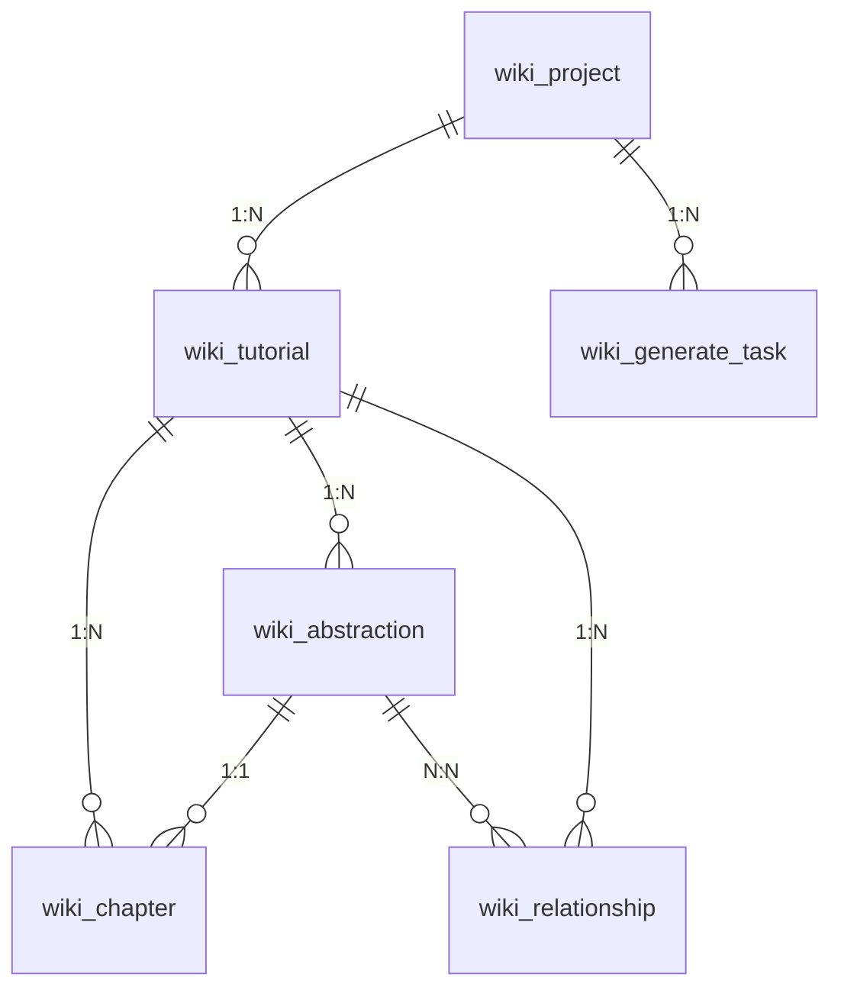

# CodeStyle Wiki 插件 - 数据库设计

> 数据库表结构设计，遵循 CodeStyle 规范
> 
> **版本**: 1.0.0  
> **文档日期**: 2026-01-29

---

## 📋 表清单

| 表名 | 说明 | 主要字段 |
|------|------|---------|
| `wiki_project` | 项目表 | id, name, source_type, source_url |
| `wiki_tutorial` | 教程表 | id, project_id, version, summary |
| `wiki_chapter` | 章节表 | id, tutorial_id, chapter_order, content |
| `wiki_abstraction` | 抽象表 | id, tutorial_id, name, description |
| `wiki_relationship` | 关系表 | id, tutorial_id, from_id, to_id |
| `wiki_generate_task` | 生成任务表 | id, project_id, status, progress |

---

## 1. wiki_project (项目表)

```sql
CREATE TABLE `wiki_project` (
  `id` bigint NOT NULL COMMENT 'ID',
  `name` varchar(100) NOT NULL COMMENT '项目名称',
  `description` varchar(500) DEFAULT NULL COMMENT '项目描述',
  `source_type` tinyint NOT NULL COMMENT '代码源类型（1:GitHub 2:本地）',
  `source_url` varchar(500) DEFAULT NULL COMMENT '源地址',
  `language` varchar(20) DEFAULT 'zh-CN' COMMENT '教程语言',
  `status` tinyint DEFAULT 1 COMMENT '状态（1:启用 2:禁用）',
  `tenant_id` bigint DEFAULT 0 COMMENT '租户ID',
  `create_user` bigint DEFAULT NULL COMMENT '创建人',
  `create_time` datetime NOT NULL DEFAULT CURRENT_TIMESTAMP COMMENT '创建时间',
  `update_user` bigint DEFAULT NULL COMMENT '修改人',
  `update_time` datetime DEFAULT NULL ON UPDATE CURRENT_TIMESTAMP COMMENT '修改时间',
  `deleted` bigint NOT NULL DEFAULT 0 COMMENT '是否删除（0否 ID是）',
  PRIMARY KEY (`id`),
  KEY `idx_tenant_id` (`tenant_id`),
  KEY `idx_create_time` (`create_time`)
) ENGINE=InnoDB DEFAULT CHARSET=utf8mb4 COLLATE=utf8mb4_unicode_ci COMMENT='Wiki项目表';
```

### 字段说明

| 字段 | 类型 | 说明 | 示例 |
|------|------|------|------|
| `id` | bigint | 主键ID | 1 |
| `name` | varchar(100) | 项目名称 | FastAPI |
| `description` | varchar(500) | 项目描述 | 现代化的 Web API 框架 |
| `source_type` | tinyint | 代码源类型 | 1:GitHub, 2:本地 |
| `source_url` | varchar(500) | 源地址 | https://github.com/tiangolo/fastapi |
| `language` | varchar(20) | 教程语言 | zh-CN, en-US |
| `status` | tinyint | 状态 | 1:启用, 2:禁用 |
| `tenant_id` | bigint | 租户ID | 0:超级管理员 |
| `create_user` | bigint | 创建人ID | 1 |
| `create_time` | datetime | 创建时间 | 2026-01-29 10:00:00 |
| `update_user` | bigint | 修改人ID | 1 |
| `update_time` | datetime | 修改时间 | 2026-01-29 11:00:00 |
| `deleted` | bigint | 逻辑删除 | 0:未删除, ID:已删除 |

---

## 2. wiki_tutorial (教程表)

```sql
CREATE TABLE `wiki_tutorial` (
  `id` bigint NOT NULL COMMENT 'ID',
  `project_id` bigint NOT NULL COMMENT '项目ID',
  `version` varchar(50) NOT NULL COMMENT '版本号',
  `summary` text COMMENT '项目摘要',
  `mermaid_diagram` text COMMENT 'Mermaid关系图',
  `status` tinyint DEFAULT 1 COMMENT '状态（1:草稿 2:已发布）',
  `publish_time` datetime DEFAULT NULL COMMENT '发布时间',
  `tenant_id` bigint DEFAULT 0 COMMENT '租户ID',
  `create_user` bigint DEFAULT NULL COMMENT '创建人',
  `create_time` datetime NOT NULL DEFAULT CURRENT_TIMESTAMP COMMENT '创建时间',
  `update_user` bigint DEFAULT NULL COMMENT '修改人',
  `update_time` datetime DEFAULT NULL ON UPDATE CURRENT_TIMESTAMP COMMENT '修改时间',
  `deleted` bigint NOT NULL DEFAULT 0 COMMENT '是否删除（0否 ID是）',
  PRIMARY KEY (`id`),
  KEY `idx_project_id` (`project_id`),
  KEY `idx_tenant_id` (`tenant_id`),
  KEY `idx_status` (`status`)
) ENGINE=InnoDB DEFAULT CHARSET=utf8mb4 COLLATE=utf8mb4_unicode_ci COMMENT='Wiki教程表';
```

### 字段说明

| 字段 | 类型 | 说明 |
|------|------|------|
| `id` | bigint | 主键ID |
| `project_id` | bigint | 项目ID（外键） |
| `version` | varchar(50) | 版本号（如：v1.0.0） |
| `summary` | text | 项目摘要 |
| `mermaid_diagram` | text | Mermaid 关系图代码 |
| `status` | tinyint | 状态（1:草稿 2:已发布） |
| `publish_time` | datetime | 发布时间 |

---

## 3. wiki_chapter (章节表)

```sql
CREATE TABLE `wiki_chapter` (
  `id` bigint NOT NULL COMMENT 'ID',
  `tutorial_id` bigint NOT NULL COMMENT '教程ID',
  `abstraction_id` bigint NOT NULL COMMENT '抽象ID',
  `chapter_order` int NOT NULL COMMENT '章节顺序',
  `title` varchar(200) NOT NULL COMMENT '章节标题',
  `content` longtext NOT NULL COMMENT '章节内容（Markdown）',
  `tenant_id` bigint DEFAULT 0 COMMENT '租户ID',
  `create_user` bigint DEFAULT NULL COMMENT '创建人',
  `create_time` datetime NOT NULL DEFAULT CURRENT_TIMESTAMP COMMENT '创建时间',
  `update_user` bigint DEFAULT NULL COMMENT '修改人',
  `update_time` datetime DEFAULT NULL ON UPDATE CURRENT_TIMESTAMP COMMENT '修改时间',
  `deleted` bigint NOT NULL DEFAULT 0 COMMENT '是否删除（0否 ID是）',
  PRIMARY KEY (`id`),
  KEY `idx_tutorial_id` (`tutorial_id`),
  KEY `idx_chapter_order` (`chapter_order`),
  KEY `idx_abstraction_id` (`abstraction_id`)
) ENGINE=InnoDB DEFAULT CHARSET=utf8mb4 COLLATE=utf8mb4_unicode_ci COMMENT='Wiki章节表';
```

### 字段说明

| 字段 | 类型 | 说明 |
|------|------|------|
| `id` | bigint | 主键ID |
| `tutorial_id` | bigint | 教程ID（外键） |
| `abstraction_id` | bigint | 抽象ID（外键） |
| `chapter_order` | int | 章节顺序（从1开始） |
| `title` | varchar(200) | 章节标题 |
| `content` | longtext | 章节内容（Markdown 格式） |

---

## 4. wiki_abstraction (抽象表)

```sql
CREATE TABLE `wiki_abstraction` (
  `id` bigint NOT NULL COMMENT 'ID',
  `tutorial_id` bigint NOT NULL COMMENT '教程ID',
  `name` varchar(100) NOT NULL COMMENT '抽象名称',
  `description` varchar(500) DEFAULT NULL COMMENT '抽象描述',
  `related_files` json DEFAULT NULL COMMENT '相关文件列表',
  `tenant_id` bigint DEFAULT 0 COMMENT '租户ID',
  `create_time` datetime NOT NULL DEFAULT CURRENT_TIMESTAMP COMMENT '创建时间',
  `deleted` bigint NOT NULL DEFAULT 0 COMMENT '是否删除（0否 ID是）',
  PRIMARY KEY (`id`),
  KEY `idx_tutorial_id` (`tutorial_id`)
) ENGINE=InnoDB DEFAULT CHARSET=utf8mb4 COLLATE=utf8mb4_unicode_ci COMMENT='Wiki抽象表';
```

### 字段说明

| 字段 | 类型 | 说明 |
|------|------|------|
| `id` | bigint | 主键ID |
| `tutorial_id` | bigint | 教程ID（外键） |
| `name` | varchar(100) | 抽象名称 |
| `description` | varchar(500) | 抽象描述 |
| `related_files` | json | 相关文件列表（JSON 数组） |

### related_files 示例

```json
[
  "src/main/java/com/example/User.java",
  "src/main/java/com/example/UserService.java"
]
```

---

## 5. wiki_relationship (关系表)

```sql
CREATE TABLE `wiki_relationship` (
  `id` bigint NOT NULL COMMENT 'ID',
  `tutorial_id` bigint NOT NULL COMMENT '教程ID',
  `from_abstraction_id` bigint NOT NULL COMMENT '源抽象ID',
  `to_abstraction_id` bigint NOT NULL COMMENT '目标抽象ID',
  `label` varchar(100) DEFAULT NULL COMMENT '关系标签',
  `tenant_id` bigint DEFAULT 0 COMMENT '租户ID',
  `create_time` datetime NOT NULL DEFAULT CURRENT_TIMESTAMP COMMENT '创建时间',
  `deleted` bigint NOT NULL DEFAULT 0 COMMENT '是否删除（0否 ID是）',
  PRIMARY KEY (`id`),
  KEY `idx_tutorial_id` (`tutorial_id`),
  KEY `idx_from_abstraction_id` (`from_abstraction_id`),
  KEY `idx_to_abstraction_id` (`to_abstraction_id`)
) ENGINE=InnoDB DEFAULT CHARSET=utf8mb4 COLLATE=utf8mb4_unicode_ci COMMENT='Wiki关系表';
```

### 字段说明

| 字段 | 类型 | 说明 |
|------|------|------|
| `id` | bigint | 主键ID |
| `tutorial_id` | bigint | 教程ID（外键） |
| `from_abstraction_id` | bigint | 源抽象ID |
| `to_abstraction_id` | bigint | 目标抽象ID |
| `label` | varchar(100) | 关系标签（如：调用、依赖） |

---

## 6. wiki_generate_task (生成任务表)

```sql
CREATE TABLE `wiki_generate_task` (
  `id` bigint NOT NULL COMMENT 'ID',
  `project_id` bigint NOT NULL COMMENT '项目ID',
  `status` tinyint DEFAULT 1 COMMENT '状态（1:待执行 2:执行中 3:成功 4:失败）',
  `progress` int DEFAULT 0 COMMENT '进度（0-100）',
  `current_step` varchar(50) DEFAULT NULL COMMENT '当前步骤',
  `error_message` text COMMENT '错误信息',
  `config` json DEFAULT NULL COMMENT '生成配置',
  `result` json DEFAULT NULL COMMENT '生成结果',
  `tenant_id` bigint DEFAULT 0 COMMENT '租户ID',
  `create_user` bigint DEFAULT NULL COMMENT '创建人',
  `create_time` datetime NOT NULL DEFAULT CURRENT_TIMESTAMP COMMENT '创建时间',
  `update_time` datetime DEFAULT NULL ON UPDATE CURRENT_TIMESTAMP COMMENT '修改时间',
  `deleted` bigint NOT NULL DEFAULT 0 COMMENT '是否删除（0否 ID是）',
  PRIMARY KEY (`id`),
  KEY `idx_project_id` (`project_id`),
  KEY `idx_status` (`status`),
  KEY `idx_create_time` (`create_time`)
) ENGINE=InnoDB DEFAULT CHARSET=utf8mb4 COLLATE=utf8mb4_unicode_ci COMMENT='Wiki生成任务表';
```

### 字段说明

| 字段 | 类型 | 说明 |
|------|------|------|
| `id` | bigint | 主键ID |
| `project_id` | bigint | 项目ID（外键） |
| `status` | tinyint | 状态（1:待执行 2:执行中 3:成功 4:失败） |
| `progress` | int | 进度（0-100） |
| `current_step` | varchar(50) | 当前步骤 |
| `error_message` | text | 错误信息 |
| `config` | json | 生成配置（JSON 对象） |
| `result` | json | 生成结果（JSON 对象） |

### config 示例

```json
{
  "maxAbstractions": 10,
  "maxFileSize": 100000,
  "includePatterns": ["*.java", "*.py"],
  "excludePatterns": ["*/test/*", "*/tests/*"]
}
```

### result 示例

```json
{
  "tutorialId": 1,
  "abstractionCount": 8,
  "chapterCount": 8,
  "totalFiles": 150,
  "processedFiles": 120
}
```

---

## 📊 ER 图



---

## 🔧 索引设计

### 主键索引

所有表都使用 `id` 作为主键，类型为 `bigint`。

### 外键索引

- `wiki_tutorial.project_id`
- `wiki_chapter.tutorial_id`
- `wiki_chapter.abstraction_id`
- `wiki_abstraction.tutorial_id`
- `wiki_relationship.tutorial_id`
- `wiki_generate_task.project_id`

### 业务索引

- `wiki_project.tenant_id` - 租户查询
- `wiki_tutorial.status` - 状态查询
- `wiki_chapter.chapter_order` - 章节排序
- `wiki_generate_task.status` - 任务状态查询

---

## 📝 设计规范

### 1. 命名规范

- ✅ 表名：小写字母 + 下划线，如 `wiki_project`
- ✅ 字段名：小写字母 + 下划线，如 `create_time`
- ✅ 索引名：`idx_` 前缀，如 `idx_tenant_id`

### 2. 必备字段

所有表必须包含：

- `id`: 主键ID（bigint）
- `create_time`: 创建时间（datetime）
- `deleted`: 逻辑删除（bigint，0:未删除，ID:已删除）

业务表还应包含：

- `tenant_id`: 租户ID（支持多租户）
- `create_user`: 创建人ID
- `update_user`: 修改人ID
- `update_time`: 修改时间

### 3. 字符集

- ✅ 字符集：`utf8mb4`
- ✅ 排序规则：`utf8mb4_unicode_ci`

### 4. 存储引擎

- ✅ 使用 `InnoDB` 存储引擎

---

**文档维护**: CodeStyle Team  
**最后更新**: 2026-01-29

