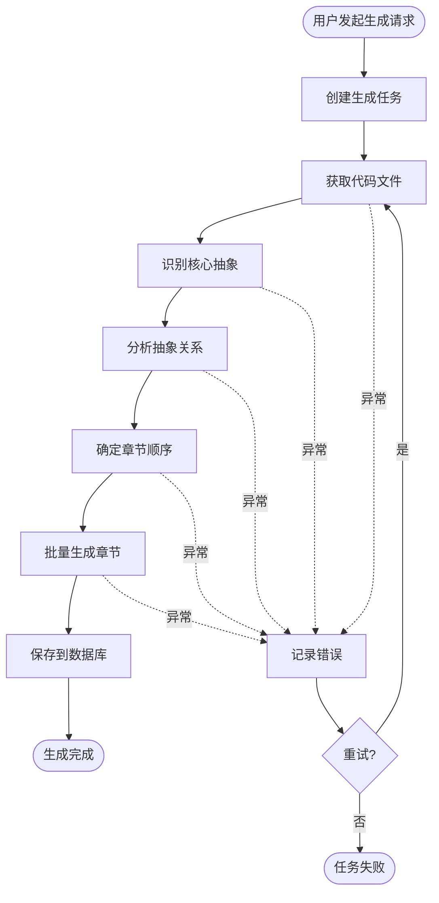

# CodeStyle Wiki 插件 - 设计文档

> 详细的架构设计和技术方案
> 
> **版本**: 1.0.0  
> **文档日期**: 2026-01-29

---

## 📋 目录

1. [架构设计](#1-架构设计)
2. [核心服务设计](#2-核心服务设计)
3. [工作流设计](#3-工作流设计)
4. [LLM 集成方案](#4-llm-集成方案)
5. [缓存策略](#5-缓存策略)
6. [异常处理](#6-异常处理)

---

## 1. 架构设计

### 1.1 整体架构

```
┌─────────────────────────────────────────────────────────┐
│                    Controller 层                         │
│  ┌──────────────────────────────────────────────────┐  │
│  │  WikiProjectController                            │  │
│  │  WikiTutorialController                           │  │
│  │  WikiGenerateController                           │  │
│  └──────────────────────────────────────────────────┘  │
└─────────────────────────────────────────────────────────┘
                            ↓
┌─────────────────────────────────────────────────────────┐
│                     Service 层                           │
│  ┌──────────────────────────────────────────────────┐  │
│  │  WikiProjectService (项目管理)                    │  │
│  │  WikiTutorialService (教程管理)                   │  │
│  │  WikiGenerateService (生成编排)                   │  │
│  │  WikiAnalysisService (代码分析)                   │  │
│  └──────────────────────────────────────────────────┘  │
└─────────────────────────────────────────────────────────┘
                            ↓
┌─────────────────────────────────────────────────────────┐
│                     Helper 层                            │
│  ┌──────────────┬──────────────┬──────────────────┐   │
│  │ LlmHelper    │ GitHelper    │ MarkdownHelper   │   │
│  │ (LLM调用)    │ (Git操作)    │ (Markdown处理)   │   │
│  └──────────────┴──────────────┴──────────────────┘   │
└─────────────────────────────────────────────────────────┘
                            ↓
┌─────────────────────────────────────────────────────────┐
│                     Mapper 层                            │
│  ┌──────────────────────────────────────────────────┐  │
│  │  WikiProjectMapper                                │  │
│  │  WikiTutorialMapper                               │  │
│  │  WikiChapterMapper                                │  │
│  │  WikiAbstractionMapper                            │  │
│  │  WikiRelationshipMapper                           │  │
│  │  WikiGenerateTaskMapper                           │  │
│  └──────────────────────────────────────────────────┘  │
└─────────────────────────────────────────────────────────┘
```

### 1.2 分层职责

| 层级 | 职责 | 命名规范 |
|------|------|---------|
| **Controller** | 处理 HTTP 请求，参数校验 | `*Controller` |
| **Service** | 业务逻辑编排，事务管理 | `*Service`, `*ServiceImpl` |
| **Helper** | 工具类，无状态辅助方法 | `*Helper` |
| **Mapper** | 数据访问，SQL 操作 | `*Mapper` |
| **Model** | 数据模型定义 | `*DO`, `*Req`, `*Resp`, `*Query` |

### 1.3 包结构

```
top.codestyle.admin.wiki/
├── controller/              # 控制器
│   ├── WikiProjectController.java
│   ├── WikiTutorialController.java
│   └── WikiGenerateController.java
│
├── service/                 # 服务接口
│   ├── WikiProjectService.java
│   ├── WikiTutorialService.java
│   ├── WikiGenerateService.java
│   └── WikiAnalysisService.java
│
├── service/impl/            # 服务实现
│   ├── WikiProjectServiceImpl.java
│   ├── WikiTutorialServiceImpl.java
│   ├── WikiGenerateServiceImpl.java
│   └── WikiAnalysisServiceImpl.java
│
├── helper/                  # 辅助工具类
│   ├── LlmHelper.java
│   ├── GitHelper.java
│   ├── MarkdownHelper.java
│   └── MermaidHelper.java
│
├── mapper/                  # 数据访问
│   ├── WikiProjectMapper.java
│   ├── WikiTutorialMapper.java
│   ├── WikiChapterMapper.java
│   ├── WikiAbstractionMapper.java
│   ├── WikiRelationshipMapper.java
│   └── WikiGenerateTaskMapper.java
│
├── model/                   # 数据模型
│   ├── entity/              # 实体类
│   ├── query/               # 查询对象
│   ├── req/                 # 请求对象
│   └── resp/                # 响应对象
│
├── enums/                   # 枚举类
│   ├── SourceType.java
│   ├── GenerateStatus.java
│   └── TutorialLanguage.java
│
├── config/                  # 配置类
│   ├── WikiProperties.java
│   └── AsyncConfig.java
│
└── constant/                # 常量类
    └── WikiConstants.java
```

---

## 2. 核心服务设计

### 2.1 WikiGenerateService

**职责**：教程生成流程编排

```java
@Service
@RequiredArgsConstructor
public class WikiGenerateServiceImpl implements WikiGenerateService {

    private final WikiAnalysisService analysisService;
    private final WikiTutorialService tutorialService;
    private final LlmHelper llmHelper;
    private final GitHelper gitHelper;
    
    @Override
    @Async
    public void generateTutorial(Long taskId) {
        // 1. 获取代码文件
        List<CodeFile> files = fetchCodeFiles(taskId);
        
        // 2. 识别抽象概念
        List<Abstraction> abstractions = analysisService.identifyAbstractions(files);
        
        // 3. 分析关系
        Relationship relationship = analysisService.analyzeRelationships(abstractions, files);
        
        // 4. 确定章节顺序
        List<Integer> chapterOrder = analysisService.orderChapters(abstractions, relationship);
        
        // 5. 生成章节内容
        List<Chapter> chapters = generateChapters(abstractions, chapterOrder, files);
        
        // 6. 保存教程
        tutorialService.saveTutorial(taskId, abstractions, relationship, chapters);
    }
}
```

### 2.2 WikiAnalysisService

**职责**：代码分析和抽象识别

```java
@Service
@RequiredArgsConstructor
public class WikiAnalysisServiceImpl implements WikiAnalysisService {

    private final LlmHelper llmHelper;
    
    @Override
    public List<Abstraction> identifyAbstractions(List<CodeFile> files) {
        // 构建提示词
        String prompt = buildIdentifyPrompt(files);
        
        // 调用 LLM
        String response = llmHelper.chat(prompt);
        
        // 解析响应
        return parseAbstractions(response);
    }
    
    @Override
    public Relationship analyzeRelationships(List<Abstraction> abstractions, List<CodeFile> files) {
        // 构建提示词
        String prompt = buildRelationshipPrompt(abstractions, files);
        
        // 调用 LLM
        String response = llmHelper.chat(prompt);
        
        // 解析响应
        return parseRelationship(response);
    }
}
```

---

## 3. 工作流设计

### 3.1 生成流程



### 3.2 任务状态机

```
PENDING (待执行)
    ↓
RUNNING (执行中)
    ↓
SUCCESS (成功) / FAILED (失败)
```

---

## 4. LLM 集成方案

### 4.1 使用 Spring AI Alibaba

```java
@Component
@RequiredArgsConstructor
public class LlmHelper {

    private final ChatClient chatClient;
    private final StringRedisTemplate redisTemplate;
    
    /**
     * 调用 LLM
     */
    public String chat(String prompt) {
        return chat(prompt, null, true);
    }
    
    /**
     * 调用 LLM（带缓存）
     */
    public String chat(String prompt, String systemPrompt, boolean useCache) {
        // 1. 检查缓存
        if (useCache) {
            String cacheKey = buildCacheKey(prompt, systemPrompt);
            String cached = redisTemplate.opsForValue().get(cacheKey);
            if (cached != null) {
                return cached;
            }
        }
        
        // 2. 构建请求
        ChatClient.ChatClientRequest request = chatClient.prompt()
            .user(prompt);
            
        if (systemPrompt != null) {
            request.system(systemPrompt);
        }
        
        // 3. 调用 LLM
        String response = request.call().content();
        
        // 4. 缓存结果
        if (useCache) {
            String cacheKey = buildCacheKey(prompt, systemPrompt);
            redisTemplate.opsForValue().set(cacheKey, response, 24, TimeUnit.HOURS);
        }
        
        return response;
    }
}
```

### 4.2 配置

```yaml
spring:
  ai:
    dashscope:
      api-key: ${DASHSCOPE_API_KEY}
      chat:
        options:
          model: qwen-plus
          temperature: 0.7
          max-tokens: 4000
```

---

## 5. 缓存策略

### 5.1 LLM 响应缓存

```
缓存键: wiki:llm:cache:{md5(prompt)}
过期时间: 24 小时
```

### 5.2 教程内容缓存

```
缓存键: wiki:tutorial:{tutorialId}
过期时间: 1 小时
```

---

## 6. 异常处理

### 6.1 重试机制

```java
@Retryable(
    value = {LlmException.class},
    maxAttempts = 3,
    backoff = @Backoff(delay = 5000)
)
public String chat(String prompt) {
    // LLM 调用
}
```

### 6.2 降级策略

- LLM 调用失败：返回默认提示
- Git 克隆失败：使用 GitHub API
- 超时控制：30 秒超时

---

**文档维护**: CodeStyle Team  
**最后更新**: 2026-01-29

